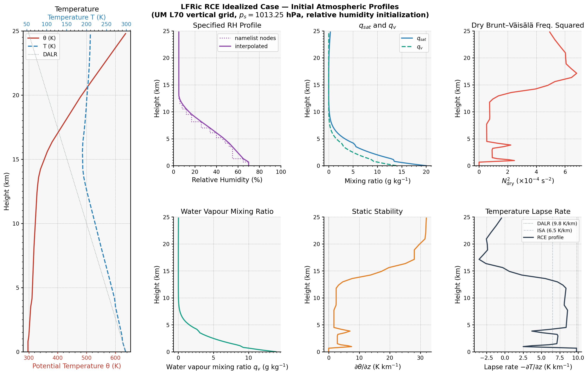

# Feature: Relative Humidity Initialization for the LFRic RCE Case

**Branch:** `initial_profiles`  
**Repos:** `lfric_apps` (based on vn3.1.1) + `lfric_core` (based on vn3.1)  
**Author:** bshipway  
**Date:** May 2026

---

## Background and Motivation

The Radiative–Convective Equilibrium (RCE) idealized test case in `lfric_atm` is used to study
convection, cloud formation, and tropical atmosphere dynamics in a doubly-periodic planar domain.
Prior to this work, the initial moisture state was set by specifying a **water vapour mixing ratio
profile** (`q_v`, kg kg⁻¹) directly via the `[namelist:initial_vapour]` rose namelist.

This is inconvenient for two reasons:

1. **Physical interpretability.** Scientists typically think in terms of *relative humidity* (RH),
   which encodes how close the air is to saturation as a fraction of the saturation mixing ratio.
   Specifying `q_v` directly requires manual pre-computation of saturation values at every level.

2. **Sensitivity to the temperature profile.** The same `q_v` value produces very different
   physical conditions depending on temperature; an RH specification is self-consistent and can be
   applied robustly across different `θ` profiles.

This feature adds a `vapour_profile_type` namelist switch that allows users to choose between the
original `'mixing_ratio'` mode and the new `'relative_humidity'` mode.  The new mode accepts RH
as a **fraction** (0 = completely dry, 1 = saturated) and converts internally to mixing ratio
using the Tetens saturation formula, consistent with the existing moist physics.

---

## Physics

### Saturation mixing ratio (Tetens formula)

The saturation mixing ratio `q_sat` (kg kg⁻¹) is computed by
`physics_common_mod::qsaturation`, which implements the Tetens formula:

$$
q_\mathrm{sat}(T, p) = \frac{3.8}{p \exp\!\left(\dfrac{-17.2693882\,(T - 273.15)}{T - 35.86}\right) - 6.109}
$$

where $T$ is temperature in K and $p$ is pressure **in mbar**.

### RH to mixing ratio conversion

The conversion from RH fraction to vapour mixing ratio follows the same algebra as the existing
`relative_humidity_kernel_mod`:

$$
q_v = \frac{\mathrm{RH} \cdot q_\mathrm{sat}}{1 + (1 - \mathrm{RH})\, q_\mathrm{sat}\, \varepsilon^{-1}}
$$

where $\varepsilon^{-1} = R_v / R_d \approx 1.608$.

The inverse (back-computing RH from `q_v`) is:

$$
\mathrm{RH} = \frac{q_v / q_\mathrm{sat}\cdot(1 + q_\mathrm{sat}\,\varepsilon^{-1})}{1 + q_v\,\varepsilon^{-1}}
$$

The implementation was verified to be self-consistent to machine precision (round-trip error
$< 3 \times 10^{-16}$).

### Initialization sequence

When `vapour_profile_type = 'relative_humidity'` the driver performs the following steps in
order:

1. Interpolate `θ` profile to model levels (unchanged from previous behaviour).
2. Compute dry Exner pressure `Π` and density `ρ` hydrostatically.
3. Interpolate the RH profile to model levels (`init_rh_profile_alg`).
4. Map Exner from W3 to Wtheta space (`map_physics_scalars`).
5. Convert RH → `q_v` using the Tetens formula (`rh_to_mr_kernel_type`).
6. Recompute moist Exner and `ρ` accounting for the added moisture.

Step 6 ensures thermodynamic consistency: the final state satisfies the moist hydrostatic
equation.

---

## Code Changes

### New files

| File | Description |
|------|-------------|
| `science/gungho/source/kernel/initialisation/rh_to_mr_kernel_mod.F90` | PSyclone kernel that converts RH fraction + (θ, Π) → `q_v` at each DOF. Calls `qsaturation`. |
| `science/gungho/source/algorithm/initialisation/init_rh_profile_alg_mod.x90` | Algorithm-layer driver: interpolates the RH profile to model levels, maps Exner to Wtheta, then invokes `rh_to_mr_kernel_type`. |
| `science/gungho/unit-test/kernel/initialisation/rh_to_mr_kernel_mod_test.pf` | pFUnit test suite: three tests covering dry air (RH=0), saturated air (RH=1), and 50% RH against the analytic formula. |
| `issues/initial_rh/plot_rce_initial_profiles.py` | Python script (this directory) that analytically reproduces all initial profiles from namelist data for visual validation. |

### Modified files

| File | Change |
|------|--------|
| `science/gungho/rose-meta/lfric-gungho/HEAD/rose-meta.conf` | Added `vapour_profile_type` namelist key with metadata, trigger, and help text. Default is `'mixing_ratio'` for backward compatibility. |
| `science/gungho/source/algorithm/initialisation/init_thermo_profile_alg_mod.x90` | Vapour interpolation block now conditional on `vapour_profile_type == 'mixing_ratio'`; skipped when RH mode is active. |
| `science/gungho/source/driver/gungho_init_prognostics_driver_mod.f90` | Added post-initialization block that calls `init_rh_profile_alg` and recomputes moist balance when `vapour_profile_type == 'relative_humidity'`. |
| `rose-stem/app/lfric_atm/opt/rose-app-rce.conf` | Updated `[namelist:initial_vapour]` to use the new RH mode with a physically motivated RH profile. |

---

## Usage

In the rose application conf file for an idealized case using `test='specified_profiles'`, add:

```ini
[namelist:initial_vapour]
vapour_profile_type='relative_humidity'
profile_size=18
profile_heights=0.0,680.0,1300.0,3500.0,4150.0,4850.0,5200.0,6100.0,7.0e3,
              =8150.0,9.5e3,10.5e3,11.5e3,12.25e3,13.0e3,14.0e3,18.0e3,40.0e3
profile_data=0.70,0.70,0.65,0.55,0.52,0.48,0.46,0.40,0.34,0.26,
            =0.17,0.12,0.08,0.06,0.05,0.05,0.05,0.05
```

The `profile_data` values are RH **fractions** (0–1). The model will interpolate these linearly
onto Wtheta levels and convert to `q_v` internally.

To revert to the old behaviour (or for any configuration that does not set `vapour_profile_type`),
the default value of `'mixing_ratio'` is used and `profile_data` is interpreted as `q_v` in
kg kg⁻¹ as before — no change is required to existing configurations.

---

## Initial Profile Diagnostics

The plot below was produced analytically from the RCE namelist data using
[`plot_rce_initial_profiles.py`](plot_rce_initial_profiles.py).
It reproduces the exact initialization logic of the Fortran code (same Tetens formula, same
linear interpolation, same hydrostatic integration) and covers the lowest 25 km of the
atmosphere on the UM L70 `50t_20s_80km` vertical grid.



### Key values at the surface

| Quantity | Value |
|----------|-------|
| Potential temperature θ | 297.0 K |
| Temperature T | 298.1 K |
| Surface pressure | 1013.2 hPa |
| Saturation mixing ratio q_sat | 20.0 g kg⁻¹ |
| Relative humidity | 70 % |
| Water vapour mixing ratio q_v | 13.9 g kg⁻¹ |

### Panel descriptions

- **Temperature (panel 1):** θ is constant at 297 K through the 800 m deep boundary layer then
  rises steeply into the stratosphere, reaching ~1400 K at 40 km. Temperature T drops from
  298 K at the surface to around 183 K near the tropical cold-point tropopause (~17 km). The
  dotted line shows the dry adiabatic lapse rate (DALR, 9.8 K km⁻¹) for reference.

- **Specified RH profile (panel 2):** The namelist nodes (step function) and their linear
  interpolation onto model levels. RH is 70% near the surface, representative of a moist
  tropical boundary layer, decreasing to 5% in the upper troposphere.

- **Saturation and actual q_v (panel 3):** q_sat (blue) decreases rapidly with height due
  to falling temperature. The actual vapour q_v (green dashed) tracks RH × q_sat, becoming
  negligible above the tropopause.

- **Water vapour mixing ratio (panel 4):** q_v peaks at 13.9 g kg⁻¹ at the surface and falls
  off to effectively zero above ~12 km, consistent with a realistic tropical atmosphere.

- **Static stability dθ/dz (panel 5):** Near-zero in the boundary layer (neutral), increasing
  through the free troposphere (~2–5 K km⁻¹), then very large in the stratosphere (>30 K km⁻¹
  at 20 km), indicating strong stratospheric stability.

- **Dry N² (panel 6):** Brunt–Väisälä frequency squared is small and positive throughout the
  troposphere, confirming stable (but weakly so) initial conditions, with a sharp increase
  at the tropopause.

- **Temperature lapse rate (panel 7):** The environmental lapse rate lies between the DALR
  (9.8 K km⁻¹, dotted) and ISA standard (6.5 K km⁻¹, dashed), confirming a conditionally
  unstable troposphere — appropriate for an RCE simulation where convection is expected to
  develop spontaneously.

---

## Convention note

Throughout all new code, docstrings, rose-meta help text, and this document, RH is consistently
defined as a **fraction** in the range [0, 1]:

- `0.0` → completely dry air
- `1.0` → saturated air

This is consistent with the convention used by the existing `relative_humidity_kernel_mod` in
`lfric_apps`.

---

## Testing

The unit test file `rh_to_mr_kernel_mod_test.pf` provides three pFUnit tests:

| Test | Conditions | Expected result |
|------|-----------|-----------------|
| `test_dry` | RH = 0 | `q_v = 0` exactly |
| `test_saturated` | RH = 1 | `q_v = q_sat` to within 1×10⁻¹⁰ |
| `test_half_rh` | RH = 0.5, θ = 297 K, Π = 1 | Analytic formula result to within 1×10⁻¹⁰ |

To run: build with the standard `make` targets using the LFRic unit-test infrastructure and
run `./rh_to_mr_kernel_mod_test`.
